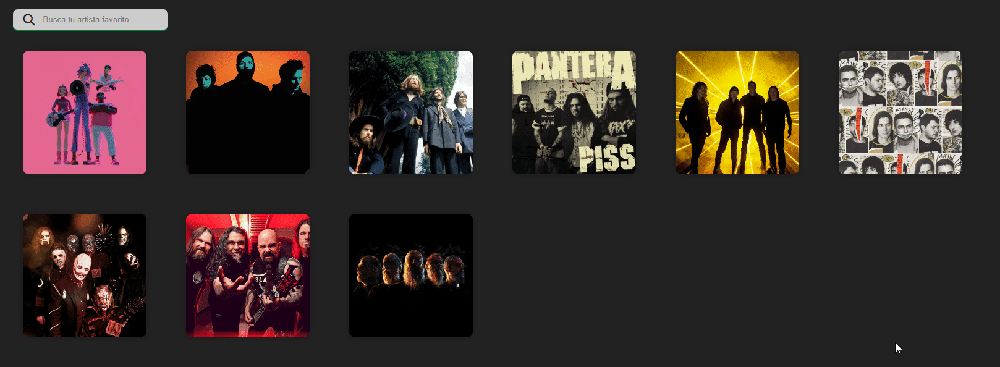

# VUETIFY - Tu primera app con Vue
VueMálaga, Jesús Narbona y Raúl Aguilar

---
## Índice

- [VUETIFY - Tu primera app con Vue](#vuetify---tu-primera-app-con-vue)
  - [Índice](#índice)
  - [Rama 2 - Filter Artists](#rama-2---filter-artists)
      - [Añadimos un input para el filtro](#añadimos-un-input-para-el-filtro)
      - [Añadimos la variable artistSearched y la función filterArtist](#añadimos-la-variable-artistsearched-y-la-función-filterartist)
  - [Tambien hemos añadido una función **filterArtist** que es la que se encarga de filtrar los artistas por el nombre que le pasemos en el input.](#tambien-hemos-añadido-una-función-filterartist-que-es-la-que-se-encarga-de-filtrar-los-artistas-por-el-nombre-que-le-pasemos-en-el-input)
    - [Resultado final](#resultado-final)

---
## Rama 2 - Filter Artists

En esta rama vamos a añadir un filtro para poder buscar artistas por nombre.
Para ello vamos a modificar el código de la rama 1.

---
#### Añadimos un input para el filtro

```vue
<template>
    <main>
        <section class="search-box">
            <i class="fa-solid fa-magnifying-glass"></i>
            <input type="text" placeholder="Busca tu artista favorito.." v-model="artistSearched" />
        </section>
        <section class="artists">
            <Artists :artist="artist" v-for="artist in filterArtist()" :key="artist.id" />
        </section>
    </main>
</template>
```
Como vemos hemos añadido un input y un icono de la librería de iconos de FontAwesome, en el archivo ArtistList.vue o nuestro componente **ArtistsList**.
Tambien algo a tener en cuenta es que hemos añadido un **v-model** al input para poder enlazarlo con una variable de nuestro componente (lo veremos en el siguiente paso).

---

#### Añadimos la variable artistSearched y la función filterArtist

```vue
import { ref, onMounted } from "vue";
import Artists from "./Artists.vue";
import { get } from "../service/http.service";
const artists = ref([]);
const artistSearched = ref("");
const filterArtist = () => {
    return artists.value.filter(({ name }) =>
        name.toLowerCase().includes(artistSearched.value.toLowerCase())
    );
};
onMounted(async () => {
    const response = await get("http://localhost:3000/artists");
    artists.value = response;
});
```

Como vemos hemos añadido una variable **artistSearched** que es la que enlazamos con el input del filtro con la directiva **v-model** que comentamo antes.

Tambien hemos añadido una función **filterArtist** que es la que se encarga de filtrar los artistas por el nombre que le pasemos en el input.
---

### Resultado final



