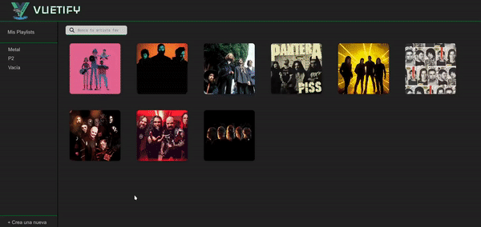
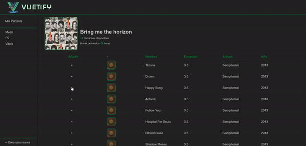

# VUETIFY - Tu primera app con Vue
VueMálaga, Jesús Narbona y Raúl Aguilar

---
## Índice

- [VUETIFY - Tu primera app con Vue](#vuetify---tu-primera-app-con-vue)
  - [Índice](#índice)
  - [Rama 4 - Artists Tracks](#rama-4---artists-tracks)
    - [Configuración de las rutas](#configuración-de-las-rutas)
    - [Redirigir al hacer click sobre los artistas](#redirigir-al-hacer-click-sobre-los-artistas)
    - [Componente para las canciones](#componente-para-las-canciones)
      - [Listar canciones](#listar-canciones)
        - [Obtener información del artista](#obtener-información-del-artista)
        - [Obtener información de las canciones](#obtener-información-de-las-canciones)
        - [Montar el template](#montar-el-template)
    - [Guardar canciones con PlaylistPopup](#guardar-canciones-con-playlistpopup)
        - [¿Cómo se usa?](#cómo-se-usa)
    - [Mensaje para el usuario](#mensaje-para-el-usuario)

---
# Rama 4 - Artists Tracks

En esta rama nos vamos a centrar en mostrar un listado con todas las canciones de cada artista cuando le demos click a cada uno. 

Además, también vamos a hacer uso del componente `PlaylistPopup`, el cual aparecerá cuando le demos a un botón en cada una de las canciones para poder guardarla en la playlist que queramos. **Este componente ya os lo damos hecho**.

Nos tendría que quedar algo parecido a esto:



---

## Configuración de las rutas

Para poder mostrar la lista de canciones de cada artistas vamos a hacer uso de rutas, mediante las cuales podremos indicar de que artista queremos obtener las canciones. Para ello es necesario usar `vue-router`.

Lo primero que haremos será dirigirnos al archivo _src/router/index.js_ (donde están todas las rutas de nuestra aplicación) y comprobar que tenemos una ruta para lo que queremos hacer. Dentro de dicho archivo podemos encontrar el siguiente código:

```js
// ...
{
    path: "/artist/:id",
    name: "artist",
    component: ArtistsTracks,
    props: true,
},
// ...
```

Esta será la ruta (llamada **artist**, y recuerda este nombre porque lo usaremos más adelante) que usaremos para pedir al "servidor" las canciones del artista que estamos buscando. Al dirigirnos a dicha ruta se cargará un nuevo componente de vista llamado `ArtistTracks`, que es donde estará la lista de canciones. También es importante colocar el atributo **props** a _true_ para que podamos pasarle el id del artista al componente que usaremos como lista de canciones usando un prop.

## Redirigir al hacer click sobre los artistas

Ya tenemos la ruta a la que vamos a ir para ver las canciones, ahora tenemos que hacer que al hacer click sobre cada artista nos redirija a dicha ruta. Para ello vamos a usar el componente `RouterLink` de `vue-router`. Este no es más que un enlace a la ruta que le indiquemos, parecido a la etiqueta `<a href=""></a>` de HTML pero con todas las funcionalidades de Vue para poder hacer redirecciones más fácilmente.

Volvemos al componente `ArtistList` que creamos anteriormente y vamos a modificar la lista de artistas de la siguiente manera para hacer uso de `RouterLink`:

```vue
<template>
<!-- ... -->

<section class="artists">
    <RouterLink
        v-for="artist in filterArtist()"
        :key="artist.id"
        :to="{ name: 'artist', params: { id: artist.id } }"
    >
        <Artists :artist="artist" />
    </RouterLink>
</section>

<!-- ... -->
</template>
        
<script setup>
// ...

// ¡Qué no se te olvide importarlo aquí!
import { RouterLink } from "vue-router";  

// ...
</script>
```

Si nos fijamos atentamente lo único que hemos hecho ha sido envolver a la etiqueta `<Artists>` con la etiqueta `<RouterLink>`. También hemos movido el `v-for` a esta última porque si no lo que tendríamos sería un único enlace que englobaría a toda la lista de artistas (y no queremos eso). 

En el atributo `to` es dónde se le especifica la ruta a la que vamos a redirigir al hacer click. A este atributo se le puede pasar un objeto con distintas propiedades. Nosotros usaremos la propiedad `name` para indicar el nombre de la ruta (**artist**) y `params`, que nos servirá para pasarle un objeto con todos los parámetros que tendrá nuestra ruta.

Como contiene código que va a variar (el id del artista) es necesario usar **:** al principio del atributo para indicar que vamos a bindear dicho valor.

Por ahora debería verse así:


---

## Componente para las canciones

Tendremos un nuevo componente llamado `ArtistTracks`, en el cual:

- Listaremos todas las canciones del artista seleccionado
- Desplegaremos un popup que se encargará de guardar la canción seleccionada dentro de la playlist que el usuario elija

Pero antes de nada vamos a dejar lista la estructura base de este componente.

### Listar canciones

#### Obtener información del artista

Para ello usaremos el id de la ruta. Para acceder dicha id podemos usar una prop: 

```vue
<script setup>
// ...

const props = defineProps({
    id: {
        type: String,
        required: true,
    },
});

// ...
</script>
```

Ahora que ya la tenemos podemos usarlo para obtener la información del artista y guardarla en una variable reactiva usando `ref()`:

```vue
<script setup>
// ...

const artist = ref({});

// Para obtener la información del artista al montar el componente
onMounted(async () => {
    artist.value = await getById(`http://localhost:3000/artists`, props.id);
});

// Para obtener la información del artista en caso de que la id cambie
watch(() => props.id, async () => {
    artist.value = await getById(`http://localhost:3000/artists`, props.id);
});

// ...
</script>
```

#### Obtener información de las canciones

Una vez tenemos la información del artista vamos a sacar las canciones a una variable aparte para poder usar dicha información de manera más sencilla. Vamos a necesitar las canciones en sí, y además el tiempo total de reproducción y el total de canciones que tiene el artista:

```vue
<script setup>
// ...

const tracks = ref([]);
const totalTime = ref(0);
const totalTracks = ref(0);

onMounted(async () => {
    // ...

    tracks.value = artist.value.tracks.map((track) => {
        return {
            ...track,
        };
    });

    totalTime.value = computed(() => {
        return tracks.value.reduce((acc, track) => {
            return acc + track.duration;
        }, 0);
    });

    totalTracks.value = computed(() => {
        return tracks.value.length;
    });

    return {
        totalTime,
        totalTracks,
    };
});

// ...
</script>
```

#### Montar el `<template>`

Nuestro `<template>` estará formado por dos partes:

1. Información del artista: Aquí mostraremos el nombre y la imagen del artista, junto con el número total de canciones y las horas de reproducción que obtuvimos anteriormente:

```vue
<template>
    <main>
        <figure>
            <div class="artist-image">
                
            </div>
            <figcaption>
                <h3>{{ artist.name }}</h3>
                <p>
                    <strong>{{ totalTracks }}</strong> canciones disponibles
                </p>
                <p>
                    Horas de música <strong>{{ totalTime }}</strong> horas
                </p>
            </figcaption>
        </figure>
        <!-- ... -->
    </main>
</template>
```

2. La lista de canciones como tal:

```vue
<template>
    <main>
        <!-- ... -->
        <section class="tracks">
            <!-- Cabecera de la tabla -->
            <div class="track">
                <h3><strong>Añadir</strong></h3>
                <h3>-</h3>
                <h3><strong>Nombre</strong></h3>
                <h3><strong>Duración</strong></h3>
                <h3><strong>Album</strong></h3>
                <h3><strong>Año</strong></h3>
            </div>
            <!-- Contenido de la tabla -->
            <div v-for="track in tracks" :key="track.id" class="track">
                <!-- Este "+" lo usaremos más adelante... -->
                <a>+</a>
                
                <p>{{ track.name }}</p>
                <p>{{ track.duration }}</p>
                <p>{{ track.album }}</p>
                <p>{{ track.year }}</p>
            </div>
        </section>
    </main>
</template>
```

Con esto ya tendríamos la lista de canciones hecha, pero no tiene ninguna funcionalidad. Ahora haremos que se puedan guardar canciones en las playlist.

---

### Guardar canciones con `PlaylistPopup`

> Nota: Para esto hay librerías con componentes ya hechos que cuentan con una mejor implementación, pero estos son más complicados de usar y no tienen cabida en una aplicación de iniciación.

Como ya comentamos al principio vamos a usar el componente `PlaylistPopup` para guardar canciones en playlist. Vamos a echarle un vistazo a las cosas más interesantes este componente:

```vue
<template>
    <template>
    <div class="popup">
        <a class="close-popup" @click="emits('closePopup')">X</a>
        <p>
            Elige la Playlist donde quieras guardar la canción
            <strong>{{ track.name }}</strong>
        </p>
        <ul>
            <li
                v-for="playlist in playlists"
                :key="playlist.id"
                @click="select(playlist.id)"
                :data-id="playlist.id"
            >
                {{ playlist.name }}
            </li>
        </ul>
        <a
            class="confirm disabled"
            ref="confirmButton"
            @click="insertTrack(artist, track)"
            >Confirmar</a
        >
    </div>
    <div class="overlay-back"></div>
</template>

<script setup>
import { ref, onMounted } from "vue";
import { usePlaylistsStore } from "../stores/playlists";
import { put } from "../service/http.service";

const props = defineProps({
    track: {
        // ...
    },
    artist: {
        // ...
    },
});

const emits = defineEmits(["closePopup", "message"]);

// ...

const select = (id) => {
    // ...
};

const insertTrack = (artist, song) => {
    // ...
    put(`http://localhost:3000/playlists/${playlist.id}`, playlist)
        .then(() => {
            emits("message", "Canción añadida a la playlist");
            emits("closePopup");
        })
        .catch(() => {
            emits("message", "Ha ocurrido un error");
            emits("closePopup");
        });
};

onMounted(async () => {
    playlists.value = usePlaylistsStore().playlists;
});
</script>
```

Lo primero que nos puede llamar la atención es el término `emits`. Estos sirven para comunicar nuestro componente con el componente padre, sería algo así como lo contrario a `props`. A estos se les pueden pasar parámetros y se les llama en la instancia del componente para, por ejemplo, llamar a una función del componente padre cuando estos son emitidos.

Otro término que aparece por ahí es `usePlaylistsStore`. Esto es una "store" de [Pinia](https://pinia.vuejs.org/), qué sirven para manejar el estado global de la aplicación. No vamos a entrar mucho en su uso, pero podemos decir que en esta aplicación se usa para tener variables y métodos que se repiten a lo largo de muchos componentes. Así es como está hecha:

```js
// src/stores/playlists.js

import { defineStore } from "pinia";
import { ref } from "vue";
import { get } from "../service/http.service";

export const usePlaylistsStore = defineStore("playlists", () => {
    const playlists = ref([]);

    const fetchPlaylists = async () => {
        const response = await get("http://localhost:3000/playlists");
        playlists.value = response;
    };

    return {
        playlists,
        fetchPlaylists,
    };
});
```

#### ¿Cómo se usa?

Volvamos al componente `ArtistTracks`. Para poder usar nuestro popup vamos a tener que modificar el código anterior. Lo primero es añadir a cada canción de la lista un booleano que usaremos para saber si el popup para dicha canción esta visible o no. Para ello añadiremos lo siguiente:

```vue
<script setup>
// ...

onMounted(async () => {
    // ...

    const showPopup = (id) => {
        tracks.value.find((track) => track.id === id).isPopupVisible = true;
    };

    const hidePopup = (id) => {
        tracks.value.find((track) => track.id === id).isPopupVisible = false;
    };

    tracks.value = artist.value.tracks.map((track) => {
        return {
            ...track,
            isPopupVisible: false,
        };
    });

    // ...

});

// ...
</script>
```

Con esto ya podremos llamar al componente del popup en el `<template>`:

```vue
<template>
    <main>
        <!-- ... -->
            <div v-for="track in tracks" :key="track.id" class="track">
                <!-- Al hacer click se mostrará el popup -->
                <a @click="showPopup(track.id)">+</a>
                <!-- Al hacer cerrar el popup dejará de estar visible -->
                <PlaylistPopup
                    v-if="track.isPopupVisible"
                    :track="track"
                    :artist="artist"
                    @close-popup="hidePopup(track.id)"
                />
                <!-- ... -->
            </div>
        </section>
    </main>
</template>
```

Debería ocurrir lo siguiente al darle al botón "+":



---

### Mensaje para el usuario

Vamos a crear un pequeño mensaje que informará al usuario que todo ha ido bien (o no...). Para ello usaremos el emit `message` del popup.

Lo primero será crear una función que reciba por parámetros el mensaje que queremos mostrar. Este parámetro será el mismo que el del emit:

```vue
<script setup>
// ...

const isMessageVisible = ref(false);

const popupMessage = (message) => {
    // Mostramos el mensaje
    isMessageVisible.value = true;

    // Con nextTick() podemos modificar el DOM en la siguiente iteración
    nextTick(() => {
        document.querySelector("#message").innerText = message;
    });

    // El mensaje estará visible por 3 segundos
    setTimeout(() => {
        isMessageVisible.value = false;
    }, 3000);
};

// ...
</script>
```

En Vue, al usar `v-if` el elemento del DOM no está creado (no existe). Por eso si intentáramos modificar un valor del mismo saltaría un error, ya que este no se crea hasta la siguiente iteración (que en este caso sería al finalizar la ejecución de la función). Pero para existe `nextTick()`, que nos permite modificar dichos valores una vez se cargue el elemento.

Si hubiésemos usado `v-show` no tendríamos este problema ya que este juega con la visibilidad del elemento, por lo que siempre está creado.

Ya sólo nos quedaría añadir el siguiente `<div>` a nuestro `<template>`:

```vue
<template>
    <main>
        <!-- ... -->
    </main>
    <div class="message" id="message" v-if="isMessageVisible"></div>
</template>
```

Y con esto debería salir un mensaje parecido al siguiente cuando insertemos una canción:


